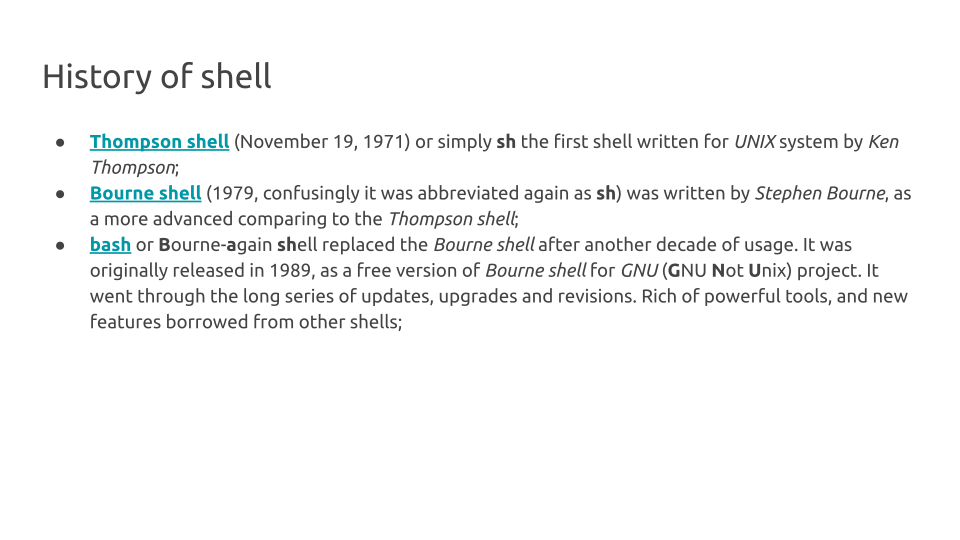

---


---


---


---



---


---


---

# Echo 

`echo` is simply *echoing* anything you type into it:

```bash
echo Hello, MOBA!
echo echo
```

---

# Comments

Whatever you print after the hash symbol (`#`) will be ignorred by bash:

```bash
# Just ignore me
```
---

# Print working directory

There are moments when you want to know where (in which directory) you are.

`pwd` stands for **p**rint **w**orking **d**irectory. When you enter this command **bash** will print your *current or working directory*.

```bash
pwd
# /home/jholden/
```

Compare it to your prompt, you are probably seeing `~` (*tilde*) symbol instead of the path to your home directory. In Linux CLI `~` is a short-hand for your home directory.

---

# Move between directories

`cd` commands stands for **c**hange **d**irectory. With `cd` you can move from your *current directory* to any directory you want, if you provide a *path* to that directory.

```bash
cd /data3    # change your working directory to data3
pwd          # print your working directory
cd ~         # return to your home directory
pwd          # print your working directory 
```
---

# List files and directories

Now, when you are at your *home directory* you can use a command `ls` to explore the directory content. The command accespts a *path* as it's argument (your *current working directory* as default if not specified) and a tones of *optional* arguments or *switches*. 

```bash
ls          # default representation
ls -l       # long format representation
ls -lha     # long representation, human-readable, all files
```

If you accidently typed `sl` instead of `ls`: pray to the Old Gods and run away.

---

# Clean your screen

Use `Ctrl` + `L` keystroke to clear your terminal window.

---

# Making directories

Now, when we are in our working directory we are going to create a new project we call *sandbox*. 

We can do it with `mkdir` command (stands for **m**a**k**e **dir**ectory). It accepts the *path* to the directory you are going to create, and several optional arguments.

```bash
mkdir sandbox               # create a new directory 'sandbox'
ls -lh                      # list files and directories
cd sandbox                  # change directory to 'sandbox'
pwd                         # print working directory
mkdir -p ./data/raw01       # create subdirectory
mkdir -p ./data/raw02       # create subdirectory
tree                        # explore the dir structure
```

---

# Creating files

You can create an empty file with `touch` command. The command accept several optional arguments, and mandatory argument(s) -- a file name(s) you are going to create:

```bash
touch ./data/raw01/dataset01.txt
touch ./data/raw02/dataset02.txt
tree
```
---


# Copying files

`cp` stands for **c**o**p**y, and is designed for copying files and directories. It accepts the path to the file or directory you want to copy, the destination path, and several optional arguments. For example `-R`, `-r`, or `--recursive` allows you to copy the content of your *source* directory *recursively*. Specifying switch `-t` before your *destination* path will instruct `cp` to copy all *source* files / directories into the *destination directory*.

```bash
cp /data3/sandbox/data/dataset03.txt -t ./data/raw02/
ls -hl ./data/raw02
```

---

# Moving files

Now we realized that we have wrong directory structure: we don't need two sub-directories for our raw data, instead we want to store all our input datasets in `./data/raw` directory. Lets move our files. 

To move a file (or directory) we use `mv` command. This command accepts path(s) to the files (directories) you are going to move, and destination path(s). 

```bash
mv -v ./data/raw02/dataset.txt -t ./data/raw01/
tree
```

Notice how we use `-v` switch to make `mv` verbose, `-t` switch to specify *target* directory, and `*` wildcard to copy both datasets.

---

# Renaming files and directories

The fact that we can specify the name of our *destination file* allows us not ony *move* but also *rename* files and directories with `mv`. Lets rename our `~/data/raw01` directory into just `~/data/raw/`:

```bash
mv -v ./data/raw01/ ./data/raw
tree
```
Notice that we use `-v` switch to make `mv` verbose.

---

# Removing files and directories

Since we successfuly copied files, and renamed our target directory, we can remove `~/sandbox/data/raw02` directory we do not need anymore.

We are going to use command `rm` which removes *files* or *directories*. To remove directories containing other files and directories, use `-r` or `-R` switch.

```bash
rm -rv ./data/raw02
tree
```
Above we use `-v` switch to make `rm` verbose and `-r` switch to recursively remove the content of the directory. 

---

# Symbolic links

The command `ln` accepts to arguments *a target* and a *link_name*. When called with a `-s` switch it will create a *symbolic link* which points from *link* to *target*. You can use it as a regular file. The only difference - it is small, and if you delete it, it will not affect the *target* file.

There is a big dataset located at `/data3/sandbox/` directory, it is too heavy, and we don't want to copy or move it around. Using `ln` command, we can create a symbolic link to this file in our working directory. 

```bash
ln -s /data3/sandbox/data/big_dataset.txt ./data/raw/
ls -lh ./data/raw
```

---

# Reading the files

The simplest command you can use for reading the content of the files is `cat`. Supply the `cat` with the path to your file, and read the content of the file on the screen. Other commands you can use are `more` and `less`.

```bash
cat ./data/raw/big_dataset.txt    # read the data file
```

---

# Clean your workspace

To clean our workspace, we are going to remove our `sandbox` project. We already know that to remove directory we can use `rm` command:

```bash
cd ~              # Return to your home directory
rm -r sandbox     # Remove your sandbox directory
ls -ahl           # List the content of the current directory
```

Notice how we use `-r` switch to remove all subdirectories of `sandbox` directory.

---

# Getting help, examples

```bash
# show manual pages for man command, press Q to exit
man man
# short single-line description for cd command
whatis cd
# see the help pages for man
help ls
# the same but using switch instead of command
man --help
```

---

# Thank you 

The `wall` command will accepts a text strign wrapped with double quotes `"`, and sends it to everyone who is logged into the server. 

```bash
wall "Thanks MOBA!"
```
