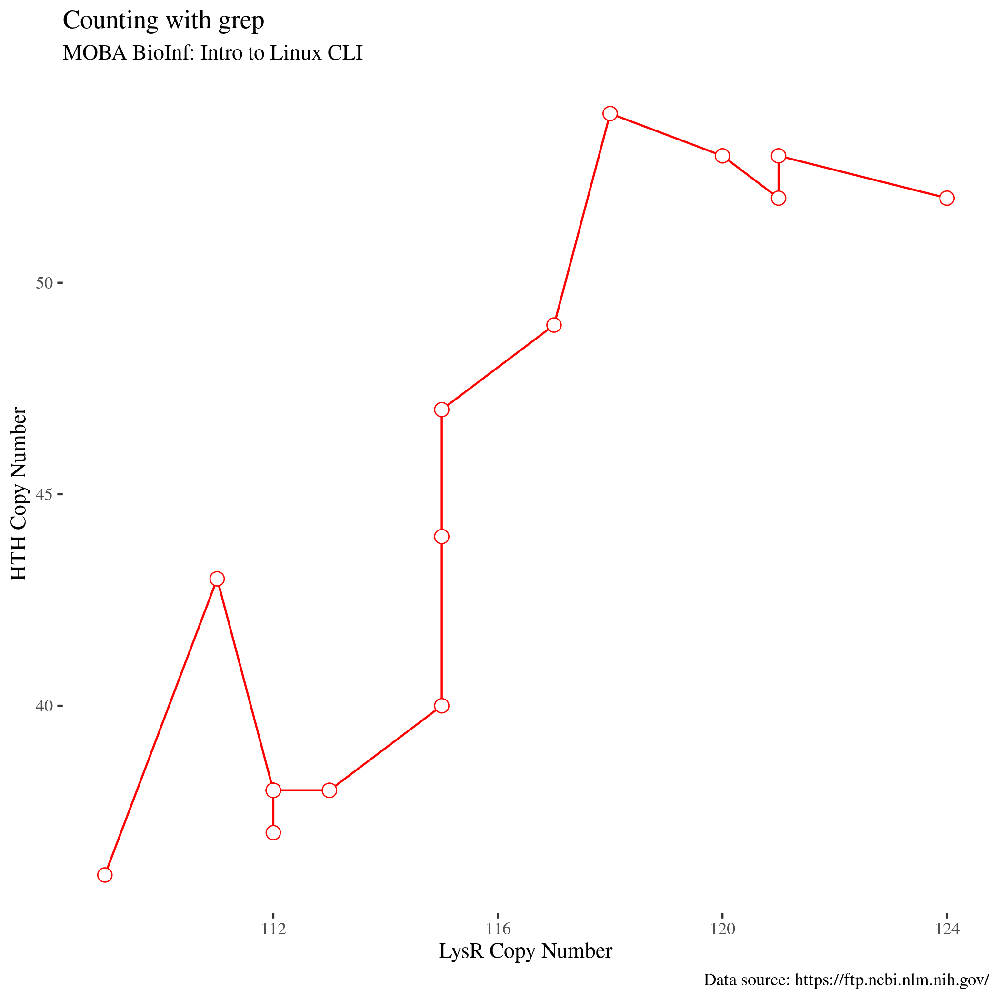

# Introduction to GNU Linux CLI <!--fit-->
Dmytro Strunin, MOBA BioInf <!--class:footer-->

---

# What is CLI?

**CLI** stands for **C**ommand **L**ine **I**nterface, usually shortened to *command line* or, by historical reasons, into *terminal*. The former dates back to the days when **UNIX** ran on large mainframes accessed via remote terminals.

---

# What is shell?

Shell is a program which serves as an interface between you and the **o**perating **s**ystem. It runs in your **terminal emulator** and allows you to your operation system. 

There are *many* such programms, which can be qualified as *shells*: *GUI*, *sh*, *csh*, *ksh*, *zsh*, *c*, *bash*.

---


---


---

# Echo 

### Usage

`echo` is simply *echoing* anything you give it as an *argument*:

```bash
echo Hello, bash!
echo echo
```
In the example above  `Hello, bash!` and second `echo` are *arguments* the command `echo` *evaluates*.

### Hands-on

Print a string *O Romeo, Romeo! Wherefore art thou Romeo?* into your screen.

---

# Comments

### Intro

Sometimes, there are situations when you want bash to *ignore* whatever you type into the terminal emulator. To do that, you can use `#` (*hash*) symbol: 

```bash
# Just ignore me
```
Whatever you type after the hash, as well as hash itself is ignorred by bash, and considered as a *comment*.

### Hands-on

Type the string *Shall I hear more, or shall I speak at this?* into the terminal, so nobody hears what Romeo just said.

---

# Brackets expansion

### Intro

A *brackets expansion* is a nice feauture of the bash which you can use in your work. Simply speaking, every argument listed within (arguments must be separated by `,`) `{}` will be evaluated separately:

```bash
echo file_{a,b,c}.txt 
echo file_{1..5}{a,b,c}
echo {a..z..2}
```

### Hands-on

Find the way to print all odd numbers within the interval [1, 10]

---

# Print working directory

### Intro

`pwd` stands for **p**rint **w**orking **d**irectory. When you enter this command **bash** will print your *current or working directory*.

```bash
pwd
# /home/jholden/
```
Look at your prompt, you are probably seeing `~` (*tilde*) symbol instead of your home directory *path* I have just found with `pwd`. In Linux CLI `~` is a short-hand for the *home directory*.

### Hands-on

Print your working directory into the terminal.

---

# Moving between directories

### Intro

`cd` command stands for **c**hange **d**irectory. With `cd` you can move from your *current directory* to any directory you want, if you provide a *path* to the target directory as an argument.

```bash
cd /data3    # change your working directory to data3
pwd          # print your working directory
```

### Hands-on

- Move from your *working directory* to the `/data3/` directory; 
- Move back to your home directory using `~` instead of the *full path* to your home directory;

---

# Relative vs absolute paths 

### Intro

Use `.` to shorthand your *current* directory, and `..` to shorthand the *parent* directory of your current directory. 

```bash
cd ./projects  # Move to the 'projects' directory inside your working directory
cd ../rawdata  # Move to the 'rawdata' which is located in the parent directory
```
### Hands-on

Move one directory above (parent directory) from your current directory. Use `pwd` to veryfy your location, and move back to your home directory using `~` instead of the *full path*.

---

# Listing the directories 

### Intro

`ls` stands for **l**i**s**t. The command general format is `ls [OPTION] ... [FILE]...`
By default, `ls` will list the content of your current directory.

- `-a`, `--all` do not ignore *hidden* files;
- `-l` use a long listing format;
- `-h` human-readable (e.g. show file size in Kb or Mb);

```bash
ls -alh
```
### Hands-on

List content of your home directory.

---

# Making directories

### Intro

To make a directory use `mkdir` command (stands for **m**a**k**e **dir**ectory). It accepts the *path* to the directory you are going to create, and several optional arguments.

```bash
mkdir sandbox               # create a new directory 'sandbox'
ls -lh                      # list files and directories
cd sandbox                  # change directory to 'sandbox'
pwd                         # print working directory
mkdir -p ./data/in          # create subdirectory
mkdir -p ./src/r            # create subdirectory
tree                        # explore the dir structure
```

### Hands-on

Create a subdirectory `sandbox` with `data` subdirectory in in your home directory with *one command*.

---

# Removing files and directories

### Intro

The command `rm` is used for removing *files* or *directories*. To remove directories containing other files and directories, use `-r` or `-R` switch.

```bash
rm ./sandbox                 # Returns an error since directory is not empty
rm -rv ./data/raw02          # Succesfully removes directory with its subdirectories
```
Above we use `-v` switch to make `rm` verbose and `-r` switch to recursively remove the content of the directory. 

### Hands-on

Remove whole `sandbox` directory and it's subdirectories.

---

# Couple of words on project structure

```
sandbox
├── data
│   ├── in
│   │   ├── csv
│   │   ├── fasta
│   │   ├── gbff
│   │   └── txt
│   └── out
│       ├── csv
│       ├── fasta
│       └── txt
└── src
    ├── r
    └── sh
```

More information: [Vince Buffalo, 2015](https://www.amazon.com/Bioinformatics-Data-Skills-Reproducible-Research/dp/1449367372) and [Noble, 2009](https://journals.plos.org/ploscompbiol/article?id=10.1371/journal.pcbi.1000424).

---

# Using brackets expansion with mkdir

### Intro

We can use brackets expansion to create a above described directory structure with one command.

```bash
mkdir -pv sandbox/{src/{sh,r},data/{in/{csv,txt,fasta,gbff},out/{csv,txt,fasta}}}

```

### Hands-on

Repeat the example above. After that create a subdirectory `img` in `./sandbox/data/out/` directory. `img` must contain subdirectories `png`, `pdf`, `svg`. Use *brackets expansion*.

---

# Creating files

### Intro

You can create an empty file with `touch` command. The command accept several optional arguments, and mandatory argument(s) - a file name(s) you are going to create:

```bash
touch logfile
tree
```

### Hands-on

It's usefull to have a ReadMe.md file in a root of your project directory, to document your work. Create a ReadMe.md file in a `sandbox` directory.

---

# Copying files

### Intro

`cp` stands for **c**o**p**y. It accepts the path to the file or directory you want to copy, the destination path, and several optional arguments (e.g. `-R`, `-r` for *recursive*, `-t` for *destination* path).

```bash
cp /home/dst20/cli02/data/txt/ncbi_links.txt -t ./data/in/txt
```

### Hands-on

Repeat the command above to copy the `ncbi_links.txt` file. But instead of copying it into your `./data/in/txt` directory, copy it into `./data/in/csv` directory. Verify that file has been copied succesfully.

---

# Moving files

### Intro

Use `mv` command (stands for **m**o**v**e) for moving files and directories. This command accepts path(s) to the files (directories) you are going to move, and destination path(s) as well as several optional arguments. 

```bash
mv -v ./data/in/csv/ncbi_links.txt -t ./data/in/txt
```

We use `-v` switch to make `mv` verbose, and `-t` switch to specify *target* directory.

### Hands-on

You realized that you copied a `.txt` file into the wrong (`.csv`) directory. Use the example above to move `ncbi_links.txt` into the directory it belongs to. Don't forget to verify that the operation was sucessful.

---

# Renaming files and directories

### Intro

The fact that we can specify the name of our *destination file* allows us not ony to *move* but also to *rename* files and directories with `mv`:

```bash
mv -v file_with_old_name.txt file_with_new_name.txt
```
Notice that we use `-v` switch to make `mv` verbose.

### Hands-on

Rename your `./data/in/txt/ncbi_links.txt` file into `./data/in/txt/ncbi_pa_assemblies_gbff.txt` using example above.

---

# Reading the files with cat

### Intro

The simplest command you can use for reading the content of the files is `cat`. Supply the `cat` with the path to your file, and read the content of the file on the screen. 

```bash
cat ./data/in/txt/ncbi_pa_assemblies_gbff.txt
```

### Hands-on

Using command above try to find out if all of the first ten links point to the `.gbff.gz` files.

---

# Heads and tails

### Intro

We can use `head` and `tail` commands to print the head and tail of the text file respectively. Commands accept few useful arguments for instance `-n` argument followed by the number of lines you want to print instead ten first (last) lines (default).

### Hands-on

- Print only first 5 lines of `./data/in/txt/ncbi_pa_assemblies_gbff.txt` file;
- Print only last 5 lines of `./data/in/txt/ncbi_pa_assemblies_gbff.txt` file;

---

# Pipes

### Intro

What if want *to chain* commands? Can we *pipe* the output of one command into another command? We can use `|` known as a *pipe operator* for this purpose. Imagine we are interested only in *last 50 lines* of our `./data/in/txt/ncbi_pa_assemblies_gbff.txt` file, however not all of them, but only *first 3 lines*?

```bash
tail ./data/in/txt/ncbi_pa_assemblies_gbff.txt -n 50 | head -n 3
```
### Hands-on

Repeat the example avbove, but this time, try to find what are the first 2 lines of the last 123 lines of the `./data/in/txt/ncbi_pa_assemblies_gbff.txt` file.

---

# more on reading the files

### Intro

Instead of `cat` we can use `more` to read text files (and more). The basic workaround is the same as for `cat`, however `more` accepts more optional arguments, and allows you to navigate through the text document in more comfortable way.

```bash
more -d ./data/in/txt/ncbi_pa_assemblies_gbff.txt
```

### Hands-on

Repeat the command above to see `more` in action.

---

# less on reading the files

### Intro

The `less` is `more`! With tones of options, it allows you to scroll up and down through the document, and even to *search* a specific string: just hit `/`, type your string and hit `<ENTER>`. `more` will highlight all the patterns it found in the document, and you can jump from one match to another pushing the `n` key!

```bash
less ./data/in/txt/ncbi_pa_assemblies_gbff.txt
```
### Hands-on

Browse the `./data/in/txt/ncbi_pa_assemblies_gbff.txt` with `more`, and locate the link to the `Pseudomonas_aeruginosa_PAKAF` assembly.

---

# Looking for patterns with grep

### Intro

`grep` looks for the *pattern* in provided text *file(s)*, and returns all the strings matching the pattern. Pattern might be defined as a *fixed* pattern or as a *regular expression*. There are many useful optional arguments, such as for example `-c` which tells `grep` to return *count* of matches. 

```bash
grep Pseudomonas_aeruginosa_PAKAF ./data/in/txt/ncbi_pa_assemblies_gbff.txt
```

### Hands-on

Find out how many complete genome assemblies we have for files matching the pattern `GCF_900`?

---

# Downloading the files

### Intro

We will use `wget` to download remote files for this course. The first argument for `wget` is the path to the remote file, which in our case is located in NCBI FTP server. The second argument (`-P`) specifies the directory we want to download our file to.

```bash
wget path_to_our_remote_file -P path_to_target_directory
```

### Hands-on

`wget` as all the rest CLI commands accepts many other useful optional arguments, check it out typing `man wget`. Specifically, find out what the `-i` option does? What `-i` option does when you provide it with `-` as an argument, instead of the *path* to the physical file? You can pipe `man` output to `less` :).

---

# Assignment: Using wget with pipes

### Description

Now when you know how to use `more` (or `less` or `cat`), pipes, grep and `wget` download genome assemblies matching the pattern matching the pattern `GCF_900`.

### Plan

1. Read a file with the links;
2. Redirrect output to `grep` and use only the links matching the pattern `GCF_900`;
3. Redirrect output to `wget` and *instruct it* to use standard output as if it was a *input file*, download files into `./data/in/gbff` directory.
---

# Answer to assignment: Using wget with pipes

### Description

```bash
cat ./data/in/txt/ncbi_pa_assemblies_gbff.txt | grep GCF_900 | wget -i - -P ./data/in/gbff
```
---


# gzip archive files

We downloaded an *archive* `.gz` files which have been created by `gnzip`. 

To list the files in the archive we can use `gunzip` itself with the `-l` option which stands for `list files`:

```bash
gunzip -l ./data/in/gbff/*.gz 
```
### Hands-on

Pipe the output from example above to appropriate command to find out how many `.gbff` files we have downloaded.

---

# Using gunzip for file extraction

### Usage

We can unzip single `.gz` file using `gunzip` command as shown in example below:

```bash
gunzip ./data/in/gbff/GCF_900185255.1_NN2_genomic.gbff.gz
```
It will extract our `.gz` file into the same directory where file is located. However we can extract all the compressed files in the directory, just given the paths to these file to `gunzip`

### Hands-on

Modify the example above to extract all the archived files into `./data/in/gbff/` directory. Hint: remember the *wild cards*?

---

# Count with grep

### Usage

Remember how we used the `grep` command to find the particular pattern's match? Now, there is a useful optional argument `-c` which stands for **count**. Imagine we are trying to find how many copies of *amidohydrolase*'s gene can be found in particular assembly. We can use `grep` command to do this job:

```bash
grep -c 'product="amidohydrolase"' ./data/in/gbff/GCF_900185255.1_NN2_genomic.gbff
```

### Hands-on

Using `grep` command find how many copies of *oxidoreductase* (remember the quotes!) gene in an assembly represented by `./data/in/gbff/GCF_900636735.1_43941_C01_genomic.gbff` file?

---

# Gentle intro to regular expressions

Well, even with the examples above, we can see there are different number of coppies for different genes. What if we are insterested in counting of all the copies for each gene to find the genes which are overrepresented in a genome? 

Instead of matching the particular protein name, let us count all the `product=.+` matches. Here `.` stands for *any symbol* and `+` says that preceeding symbol is *repeated one or more times*. 

Such patterns are called a *regular expressions*. Regular expressions rules is the language by it's own, and might be very difficult to grasp, but we are going to use really simple regex for our task.


---

# Using regular expressions with grep

### Usage

We are going to count all the matches for `product=.+` in the file `GCF_900185255.1_NN2_genomic.gbff`. In order to be able to do that, we have to use `-E` switch which tells `grep` that we are using **e**xtended regular expression as a pattern. As in previous example, we are going to feed `grep` with `-c` switch so we will receive *number* of matches, not the matches themselves.

```bash
grep -c -E 'product=.+' ./data/in/gbff/GCF_900185255.1_NN2_genomic.gbff
# whooops...
```

### Hands-on

Browse through the `.gbff` file from the example to find out where this number came from. Remember `less`?

---

# Sort grep output

Well, obviously, in previous example we've just found the number of genes for the genome, because `grep` just counted the number of matches. It's nice, but we don't need it. Can we do it by hand, just browsing through the matches to pick the genes with high number of copies? We don't need `-c` this time, just `less`

```bash
grep -E 'product=.+' ./data/in/gbff/GCF_900185255.1_NN2_genomic.gbff | less
```

Not really... But we can pipe `grep` output into `sort` command, which will sort the output in alphabetical order!

```bash
grep -E 'product=.+' ./data/in/gbff/GCF_900185255.1_NN2_genomic.gbff | sort | less
```

Much better. But hey, it's 6426 genes and we have several hundreds genomes only on our server. It will take forever to finish our task. 

---

# Unique count

## Usage

There are the good news. We have another unique command in our toolbox it is... `uniq`. The command reports or omit adjucent repeated lines. It also accept `-c` switch to **c**ount repeated lines, and `-d` switch to print *only duplicated lines*. Lets try this:

```bash
grep -E 'product=.+' ./data/in/gbff/GCF_900185255.1_NN2_genomic.gbff | sort | uniq -dc | less
```

## Hands-on

Repeat the example above. **What** is the problem with the output? **Why**?

---

# Add another sort to pipeline

### Explanation

The `sort` sorts `grep` output in alphabetical order, so when `uniq -dc` takes its turn, it counts all repeated lines in the very same order.

### Solution

The solution is to pipe the output into yet another `sort` command. We use `-n` and `-r` switches (*numeric sort* and *reverse* respectively), so the records with the highest counts appears atop.

```bash
grep -E 'product=.+' ./data/in/gbff/GCF_900185255.1_NN2_genomic.gbff | sort | uniq -dc | sort -nr | less
```
### Hands-on

Repeat the example and inspect the output.

--- 

# Using grep for pattern match accross the files

### Explanation

It is possible to use `grep` to search patterns in several files. We can see that *LysR* is the gene with the highest copy number. Imagine we want to compare the copy number of *LysR* accross all assemblies in our `data` folder. We can do it this way:

```bash
grep -c 'LysR family transcriptional regulator'  ./data/in/gbff/*.gbff
```

### Hands-on

Find the counts for *helix-turn-helix transcriptional regulator* using example above. Use `-h` switch to suppress file names prefixing.

---

# Redirrecting standard output

### Explanation

We can see some numbers on the screen, which is fine. But we have to save our work some how. To *redirect* the output of *command* to the *file* we can use another tool, `>` or *redirrection operator*. 

### Example

```bash
grep -hc 'LysR family transcriptional regulator'  ./data/in/gbff/*.gbff > ./data/out/txt/LysR.txt
```

### Hands-on

Repeat the example above. Use it as a template to save the results for *helix-turn-helix transcriptional regulator* into *HTH.txt file*.

---

# Saving data to csv file

### Explanation

Our datasets are stored in separate files. We can save both datasets into one `.csv` file. We can use another command `paste` for this purpose. The command merges lines of files given as an input arguments. By default line elements are separated by `<TAB>`.

### Example

```bash
paste -d , ./data/out/txt/LysR.txt ./data/out/txt/HTH.txt
```

### Hands-on

Using the example above *redirrect the output* into `./data/out/csv/gene_count.csv`. Inspect the file using `less` or `cat`.

---

# Run scripts

### Explanation

I wrote shell script to visualize your data. You can run this simply by entering absolute or relative path to the script file.

To run an R script, use `Rscript` followed by the path to the file.

### Example

We can run the script `myscript.sh` which is stored in `./src/sh` directory as follows:

```bash
Rscript ./src/sh/myscript.R
```

### Hands-on

Copy the script from `./home/dst20/sandbox/src/r/runme.R` to your `./src/r` directory. Run the script using the example above as a template.

---

# Run script



---

# Getting help, examples

```bash
# show manual pages for man command, press Q to exit
man man
# short single-line description for cd command
whatis cd
# see the help pages for man
help ls
# the same but using switch instead of command
man --help
```

---

# Thank you 
