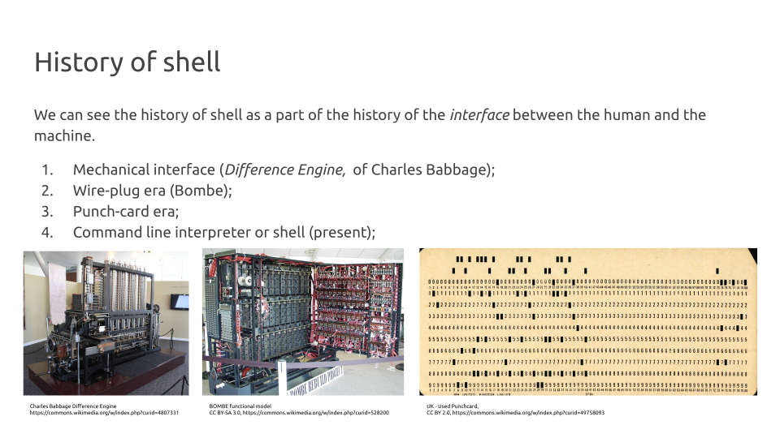
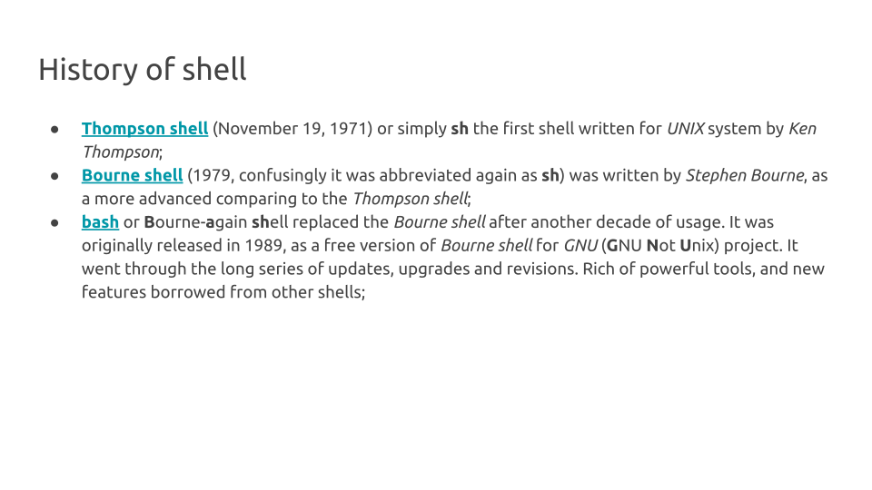
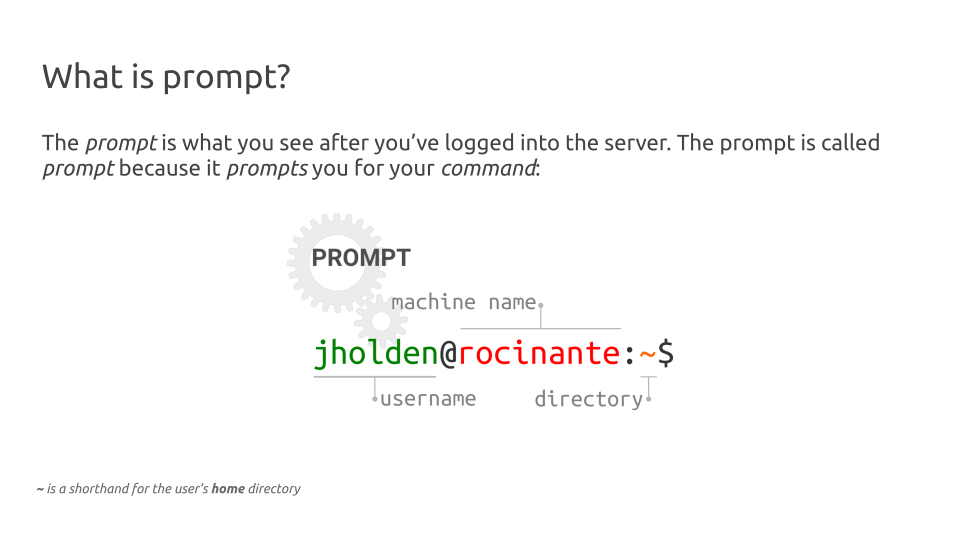
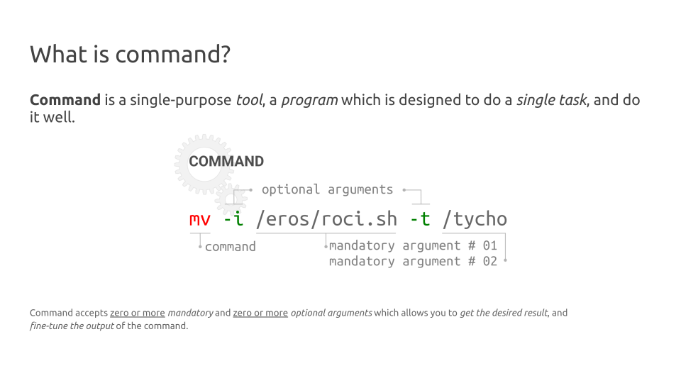

# Getting started with GNU Linux CLI <!--fit-->
Dmytro Strunin, MOBA BioInf <!--class:footer-->

---

# What is CLI?

**CLI** stands for **C**ommand **L**ine **I**nterface, usually shortened to *command line* or, by historical reasons, into *terminal*. The former dates back to the days when **UNIX** ran on large mainframes accessed via remote terminals.

---
# How to access CLI?

If you are working on the system *with* **G**raphical **U**ser **I**nterface (*GUI*) CLI can be accessed through **terminal emulator**, e.g. on **Ubuntu** Linux push `<Ctrl> + <Alt> + T` to open terminal emulator.

Working on the systems *without* GUI, you can interact with it **only** through the CLI, as presumebly you are doing *right now*.

---

# What is Virtual Console?

**V**irtual **c**onsole is a tool allowing you to access the same machine making several alternative connections (dates back to the UNIX times). On most Linux versions you can access up to 7 VCs using <Ctrl> + <Alt> + <Fx> keystroke:

- `<Ctrl> + <Alt> + <F1>` to access first VC;
- `<Ctrl> + <Alt> + <F2>` to access second VC;
- ...
- `<Ctrl> + <Alt> + <F7>` to access seventh VC;

Usually, on systems running GUI, GUI runs on the seventh VC (`<F7>`) by default.

---

# What is shell?

Shell is a program which serves as an interface between you and the **o**perating **s**ystem. It runs in your **terminal emulator** and allows you to issue commands *interactively* or *non-interactively*. 

There are *many* such programms, which can be qualified as *shells*: *GUI*, *sh*, *csh*, *ksh*, *zsh*, *c*, *bash*.

---



---



---



---



---

# Echo 

### Usage

`echo` is simply *echoing* anything you give it as an *argument*:

```bash
echo Hello, bash!
echo echo
```
In the example above  `Hello, bash!` and second `echo` are *arguments* the command `echo` *evaluates*.

### Hands-on

Make CLI print a string *O Romeo, Romeo! Wherefore art thou Romeo?* into your screen.

---

# Comments

### Usage

Sometimes, there are situation when you want CLI to *ignore* whatever you type into the terminal emulator. To do that, you can use `#` (*hash*) symbol: 

```bash
# Just ignore me
```
Whatever you type after the hash, as well as hash itself is ignorred by bash, and considered as a *comment*.

### Hands-on

Type the string *Shall I hear more, or shall I speak at this?* into the terminal, so nobody hears what Romeo just said.

---

# Other useful comands

### Usage

```bash
echo Hello bash! # Print 'Hello bash!' to the screen
whoami           # Shows your username
who              # Refers back to Thompson shell, shows who is logged in
echo $BASH       # Prints the path for your shell executable
bash --version   # Shows the detailed information about your bash version
```
### Hands-on

Find out how many users are logged into the system at the moment.

---

# Brackets expansion

### Usage

A *brackets expansion* is a nice feauture of the bash which you can use in your work. Simply speaking, everya rgument listed within (arguments must be separated by `,`) `{}` will be evaluated separately:

```bash
echo file_{a,b,c}.txt 
echo file_{1..5}{a,b,c}
echo {a..z..2}
```

### Hands-on

- Find the way to print all odd numbers within the interval [1, 100]
- Find the way to print all well labels for 96-well plate (e.g. A1, A2, ..., H11, H12)

---

# Print working directory

### Usage

There are moments when you want to know where (in which directory) you are.

`pwd` stands for **p**rint **w**orking **d**irectory. When you enter this command **bash** will print your *current or working directory*.

```bash
pwd
# /home/jholden/
```

### Hands-on

Look at your prompt, you are probably seeing `~` (*tilde*) symbol instead of your home directory *path* I have just found with `pwd`. In Linux CLI `~` is a short-hand for the *home directory*.

---

# Move between directories

### Usage

`cd` commands stands for **c**hange **d**irectory. With `cd` you can move from your *current directory* to any directory you want, if you provide a *path* to that directory.

```bash
cd /data3    # change your working directory to data3
pwd          # print your working directory
```

### Hands-on

- Move from your *working directory* to the `/data3/` directory; 
- Verify that your *current directory* is `/data3/`;
- Move back to your home directory (Remember: `~`?);

---

# Relative vs absolute paths 

### Usage

Use `.` to shorthand your *current* directory, and `..` to shorthand the *parent* directory of your current directory. 

```bash
cd ./projects  # Move to the 'projects' directory inside your working directory
cd ../rawdata  # Move to the 'rawdata' which is located in the parent directory
```
### Hands-on

Move one directory above (parent directory) from your current directory. Use `pwd` to veryfy your location, and move back to your home directory (Remember `~`)

---

# Other tricks with cd

### Usage

- After `cd` command pushing `<TAB>` you can use *command completion* to save your typing;
- `~` is a short-hand for *home directory*. Wherever you are `cd ~` or just `cd` will always take you home; 
- `-` holds the path to the previously visited directory. `cd -` will take you to the place you visited before.

### Hands-on

- Use `cd` and `<TAB>` to randomly walk between the directories;
- Go back home;
- Go back to previous dir you visited, and return home again.

---

# Listing the directories 

### Usage

`ls` stands for **l**i**s**t. The command general format is `ls [OPTION] ... [FILE]...`
By default, `ls` will list the content of your current directory.

- `-a`, `--all` do not ignore *hidden* files;
- `-l` use a long listing format;
- `-h` human-readable (e.g. show file size in Kb or Mb);

```bash
ls -alh
```
### Hands-on

List content of your current working directory.

---

## Aditional arguments of ls

There are many other options you can use with `ls` command

- `-X` sort alphabetically by entry extension;
- `-t` sort by modification time, newest first;
- `-S` sort by file size, largest first;
- `-R`, `--recursive` list subdirectories recursively;
- `-L`, `--difference` show the information for the file, instead a symbolic link;

---

# Clean your screen

Use `Ctrl` + `L` keystroke to clear your terminal window.

---

# Making directories

### Usage

We can use `mkdir` command (stands for **m**a**k**e **dir**ectory). It accepts the *path* to the directory you are going to create, and several optional arguments.

```bash
mkdir sandbox               # create a new directory 'sandbox'
ls -lh                      # list files and directories
cd sandbox                  # change directory to 'sandbox'
pwd                         # print working directory
mkdir -p ./data/raw01       # create subdirectory
mkdir -p ./data/raw02       # create subdirectory
tree                        # explore the dir structure
```

### Hands-on

Create a subdirectory `src` in a `sandbox` directory. Create `sh` and `r` subdirectory in created `src` subdirectory.

---

# Removing files and directories

### Usage

The command `rm` is used for removing *files* or *directories*. To remove directories containing other files and directories, use `-r` or `-R` switch.

```bash
rm ./sandbox                 # Returns an error since directory is not empty
rm -rv ./data/raw02          # Succesfully removes directory with its subdirectories
```
Above we use `-v` switch to make `rm` verbose and `-r` switch to recursively remove the content of the directory. 

### Hands-on

Remove whole `sandbox` directory and it's subdirectories.

---

# Couple of words on project structure

```
sandbox
├── data
│   ├── in
│   │   ├── csv
│   │   ├── fasta
│   │   ├── gbff
│   │   └── txt
│   └── out
│       ├── csv
│       ├── fasta
│       └── txt
└── src
    ├── r
    └── sh
```

More information: [Vince Buffalo, 2015](https://www.amazon.com/Bioinformatics-Data-Skills-Reproducible-Research/dp/1449367372) and [Noble, 2009](https://journals.plos.org/ploscompbiol/article?id=10.1371/journal.pcbi.1000424).

---

# Using brackets expansion with mkdir

### Usage

We can use brackets expansion to create a above described directory structure with one command.

```bash
mkdir -pv sandbox/{src/{sh,r},data/{in/{csv,txt,fasta,gbff},out/{csv,txt,fasta}}}

```

### Hands-on

Create a subdirectory `img` in `./sandbox/data/out/` directory. `img` must contain subdirectories `png`, `pdf`, `svg`. Use *brackets expansion*.

---

# Creating files

### Usage

You can create an empty file with `touch` command. The command accept several optional arguments, and mandatory argument(s) - a file name(s) you are going to create:

```bash
touch logfile
tree
```

### Hands-on

It's usefull to have a ReadMe.md file in a root of your project directory, documenting your work. Create a ReadMe.md file in a `sandbox` directory.

---


# Copying files

### Usage

`cp` stands for **c**o**p**y. It accepts the path to the file or directory you want to copy, the destination path, and several optional arguments (e.g. `-R`, `-r` for *recursive*, `-t` for *destination* path).

```bash
cp /home/dst20/cli02/data/txt/ncbi_links.txt -t ./data/in/txt
```

### Hands-on

Repeat the command above to copy the `ncbi_links.txt` file. But instead of copying it into your `./data/in/txt` directory, copy it into `./data/in/csv` directory. Verify that file has been copied succesfully (Hint: use `ls` or `tree` commands explained above).

---

# Moving files

### Usage

Use `mv` command (stands for **m**o**v**e) for moving files and directories. This command accepts path(s) to the files (directories) you are going to move, and destination path(s) as well as several optional arguments. 

```bash
mv -v ./data/in/csv/ncbi_links.txt -t ./data/in/txt
```

We use `-v` switch to make `mv` verbose, and `-t` switch to specify *target* directory.

### Hands-on

You realized that you copied a `.txt` file into the wrong (`.csv`) directory. Use the example above to move `ncbi_links.txt` into the directory it belongs to. Don't forget to verify that the operation was sucessful.

---

# Renaming files and directories

### Usage

The fact that we can specify the name of our *destination file* allows us not ony *move* but also *rename* files and directories with `mv`:

```bash
mv -v file_with_old_name.txt file_with_new_name.txt
```
Notice that we use `-v` switch to make `mv` verbose.

### Hands-on

We want our input data file names to be informative. Rename your `./data/in/txt/ncbi_links.txt` file into `./data/in/txt/ncbi_pa_assemblies_gbff.txt` using example above.

---

# Reading the files with cat

The simplest command you can use for reading the content of the files is `cat`. Supply the `cat` with the path to your file, and read the content of the file on the screen. 

```bash
cat ./data/in/txt/ncbi_pa_assemblies_gbff.txt
```

### Hands-on

Using command above try to find out if all of the first ten links point to the `.gbff.gz` files.

---

# Heads and tails

### Usage

We can use `head` and `tail` commands to print the head and tail of the text file respectively. Commands accept few useful arguments for instance `-n` argument followed by the number of line you want to print instead ten first (last) lines (default).

### Hands-on

- Print only first 5 lines of `./data/in/txt/ncbi_pa_assemblies_gbff.txt` file;
- Print only last 5 lines of `./data/in/txt/ncbi_pa_assemblies_gbff.txt` file;

---

# Few words about the pipes

### Usage

What if want *to chain* commands? Or, in other words, *pipe* the output of one command into another command? We can use `|` known as a *pipe operator* for this purpose. Let say we are interested only in *last 50 lines* of our `./data/in/txt/ncbi_pa_assemblies_gbff.txt` file, however not all of them, but only *first 3 lines*?

```bash
tail ./data/in/txt/ncbi_pa_assemblies_gbff.txt -n 50 | head -n 3
```
### Hands-on

Repeat the example avbove, but this time, try to find the what are the first 2 lines of the last 123 lines of the `./data/in/txt/ncbi_pa_assemblies_gbff.txt` file.

---

# more on reading the files

### Usage

Instead of `cat` you can use `more` to read text files (and more). The basic workaround is the same as for `cat`, however `more` accepts more optional arguments, and allows you to navigate through the text document in more comfortable way.

```bash
more -d ./data/in/txt/ncbi_pa_assemblies_gbff.txt
```

### Hands-on

Repeat the command above to see `more` in action.

---

# less on reading the files

### Usage 

The `less` is `more`! You'd better read the `less`'s manual pages! With tones of options, it allows you to scroll up and down through the document, and even to *search* a specific string: just hit `/` while you brouwsing, type your string and hit `<ENTER>`. `more` will highlight all the patterns it found in the document, and you can jump from one match to another pushing the `n` key!

```bash
less ./data/in/txt/ncbi_pa_assemblies_gbff.txt
```
### Hands-on

Browse the `./data/in/txt/ncbi_pa_assemblies_gbff.txt` with `more` locate the link to the `Pseudomonas_aeruginosa_PAKAF` assembly.

---

# Looking for patterns with grep

### Usage

`grep` looks for the *pattern* in provided text *file(s)* and returns all the strings matching the pattern. Pattern might be defined as a *fixed* pattern or as a *regular expression*. There are many useful optional arguments, such as for example `-c` which tells `grep` to return *count* of matches. For example to find the assembly from the previouse slide, we can simply do:

```bash
grep Pseudomonas_aeruginosa_PAKAF ./data/in/txt/ncbi_pa_assemblies_gbff.txt
```

### Hands-on

Find out how many complete genome assemblies we have for files matching the pattern `GCF_900`?

---

# Using less, |, and grep for pattern matching

### Usage

We can *pipe* `less` output into `grep` to do the pattern search, like it shown in example below:

```bash
less ./data/in/txt/ncbi_pa_assemblies_gbff.txt | grep GCF_900
```

### Hands-on

--- 

# Downloading the files

### Usage

We can use `curl` or `wget` commands to download remote fils. We will use `wget` for this course. The first argument for `wget` is the path to the remote file, which in our case is located in NCBI FTP server. The second argument (`-P`) specifies the directory we want to download our file to.

```bash
wget path_to_our_remote_file -P path_to_target_directory
```

### Hands-on

`wget` as all the rest CLI commands accepts many other useful optional arguments, check it out typing `man wget`. Specifically, find out what the `-i` option does? What `-i` option does when you provide it with `-` as an argument, instead of the *path* to the physical file? You can pipe `man` output to `less` :).

---

# Assignment: Using wget with pipes

### Description

Now when you know how to use `more` (or `less` or `cat`), pipes, grep and `wget` download genome assemblies matching the pattern matching the pattern `GCF_900`.

### Plan

1. Read a file with the links;
2. Redirrect output to `grep` and use only the links matching the pattern `GCF_900`;
3. Redirrect output to `wget` and *instruct it* to use standard output as if it was a *input file*, download files into `./data/in/gbff` directory.
---

# Answer to assignment: Using wget with pipes

### Description

```bash
cat ./data/in/txt/ncbi_pa_assemblies_gbff.txt | grep GCF_900 | wget -i - -P ./data/in/gbff
```
---


# gzip archive files

We downloaded an *archive* `.gz` files which have been created by `gnzip`. 

To list the files in the archive we can use `gunzip` itself with the `-l` option which stands for `list files`:

```bash
gunzip -l ./data/in/gbff/*.gz 
```
### Hands-on

Pipe the output from example above to appropriate command to find out how many `.gbff` files we have downloaded.

---

# Using gunzip for file extraction

### Usage

We can unzip single `.gz` file using `gunzip` command as shown in example below:

```bash
gunzip ./data/in/gbff/GCF_900185255.1_NN2_genomic.gbff.gz
```
It will extract our `.gz` file into the same directory where file is located. However we can extract all the compressed files in the directory, just given the paths to these file to `gunzip`

### Hands-on

Modify example above to extract all the archived files into `./data/in/gbff/` directory. Hint: remember the *wild cards*?

---

# Reading the text file

Our goal now is to explore the file we downloaded and unzipped before. Lets read it first. You remember that we can use several commands for this purpose e.g. `cat`, `more`, `less`. Try to explore the file content using `cat` and `less` commands. Answer the following questions:

1. Read the file using `cat`. What are the pros & contras?
3. Read the file using `less`. What are the pros & contras?
4. What kind of organism we are dealing with?
5. How many genes are identified in this assembly?
6. How many rRNA, tRNA, ncRNA genes are there? 
7. What is the starting position of `ggtacgggta` sequence in genome?

---
# Reading text files, answers

We can read the file using `cat` or `less` command as follows:

```bash
grep -ch "DEAD/DEAH box helicase"  ./data/in/gbff/*.gbff
grep -oP '/product=[^,]*'  ./data/in/gbff/GCF_900185255.1_NN2_genomic.gbff |sort | uniq -ufc | less
grep -oP '/product=[^,]*'  ./data/in/gbff/GCF_900185255.1_NN2_genomic.gbff | sort | uniq -c | sort -nr | less
"AraC family transcriptional regulator"
"helix-turn-helix transcriptional regulator"
"LysR family transcriptional regulator"
"MFS transporter"
```
We are dealing with *Pseudomonas aeruginosa*:

```
#  ORGANISM  Pseudomonas aeruginosa
#            Bacteria; Proteobacteria; Gammaproteobacteria; Pseudomonadales;
#            Pseudomonadaceae; Pseudomonas.
```
There are 6,215 genes in total, and 12 rRNAs genes, 64 tRNAs genes and 5 ncRNA genes (81 in total). 

Last question is the hardest one, the sequence can be found at postion `3556921`.

---

# Symbolic links

The command `ln` accepts to arguments *a target* and a *link_name*. When called with a `-s` switch it will create a *symbolic link* which points from *link* to *target*. You can use it as a regular file. The only difference - it is small, and if you delete it, it will not affect the *target* file.

There is a big dataset located at `/data3/sandbox/` directory, it is too heavy, and we don't want to copy or move it around. Using `ln` command, we can create a symbolic link to this file in our working directory. 

```bash
ln -s /data3/sandbox/data/big_dataset.txt ./data/raw/
ls -lh ./data/raw
```
---

# Clean your workspace

To clean our workspace, we are going to remove our `sandbox` project. We already know that to remove directory we can use `rm` command:

```bash
cd ~              # Return to your home directory
rm -r sandbox     # Remove your sandbox directory
ls -ahl           # List the content of the current directory
```

Notice how we use `-r` switch to remove all subdirectories of `sandbox` directory.

---

# Getting help, examples

```bash
# show manual pages for man command, press Q to exit
man man
# short single-line description for cd command
whatis cd
# see the help pages for man
help ls
# the same but using switch instead of command
man --help
```

---

# Thank you 

The `wall` command will accepts a text strign wrapped with double quotes `"`, and sends it to everyone who is logged into the server. 

```bash
wall "Thanks MOBA!"
```
