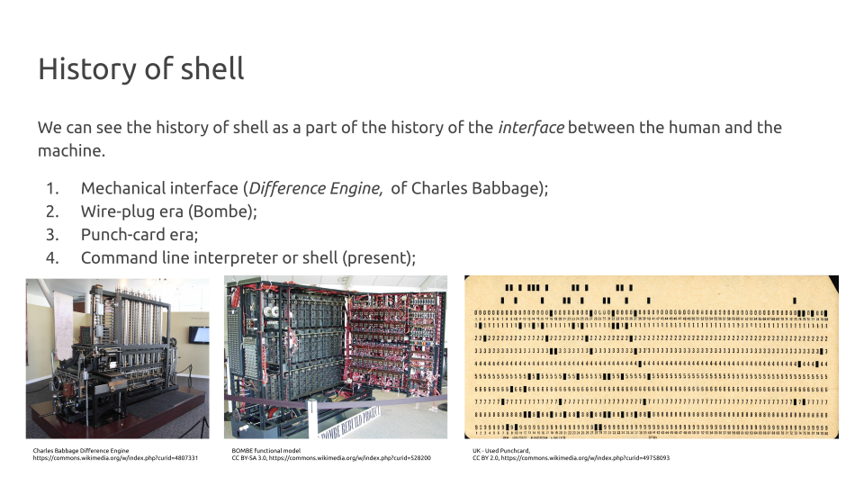

# Getting started with GNU Linux CLI <!--fit-->
Dmytro Strunin, MOBA BioInf <!--class:footer-->

---

# What is CLI?

**CLI** stands for **C**ommand **L**ine **I**nterface, usually shortened to *command line* or, by historical reasons, into *terminal*. The former dates back to the days when **UNIX** ran on large mainframes accessed via remote terminals.

---
# How to access CLI?

If you are working on the system *with* **G**raphical **U**ser **I**nterface (*GUI*) CLI can be accessed through **terminal emulator**, e.g. on **Ubuntu** Linux push `<Ctrl> + <Alt> + T` to open terminal emulator.

Working on the systems *without* GUI, you can interact with it **only** through the CLI, as presumebly you are doing *right now*.

---

# What is Virtual Console?

**V**irtual **c**onsole is a tool allowing you to access the same machine making several alternative connections (dates back to the UNIX times). On most Linux versions you can access up to 7 VCs using <Ctrl> + <Alt> + <Fx> keystroke:

- `<Ctrl> + <Alt> + <F1>` to access first VC;
- `<Ctrl> + <Alt> + <F2>` to access second VC;
- ...
- `<Ctrl> + <Alt> + <F7>` to access seventh VC;

Usually, on systems running GUI, GUI runs on the seventh VC (`<F7>`) by default.

---

# What is shell?

Shell is a program which serves as an interface between you and the **o**perating **s**ystem. It runs in your **terminal emulator** and allows you to issue commands *interactively* or *non-interactively*. 

There are *many* such programms, which can be qualified as *shells*: *GUI*, *sh*, *csh*, *ksh*, *zsh*, *c*, *bash*.

---



---


---


---


---

# Echo 

### Usage

`echo` is simply *echoing* anything you give it as an *argument*:

```bash
echo Hello, bash!
echo echo
```
In the example above  `Hello, bash!` and second `echo` are *arguments* the command `echo` *evaluates*.

### Hands-on

Make CLI print a string *O Romeo, Romeo! Wherefore art thou Romeo?* into your screen.

---

# Comments

### Usage

Sometimes, there are situation when you want CLI to *ignore* whatever you type into the terminal emulator. To do that, you can use `#` (*hash*) symbol: 

```bash
# Just ignore me
```
Whatever you type after the hash, as well as hash itself is ignorred by bash, and considered as a *comment*.

### Hands-on

Type the string *Shall I hear more, or shall I speak at this?* into the terminal, so nobody hears what Romeo just said.

---

# Other useful comands

### Usage

```bash
echo Hello bash! # Print 'Hello bash!' to the screen
whoami           # Shows your username
who              # Refers back to Thompson shell, shows who is logged in
echo $BASH       # Prints the path for your shell executable
bash --version   # Shows the detailed information about your bash version
```
### Hands-on

Find out how many users are logged into the system at the moment.

---

# Brackets expansion

### Usage

A *brackets expansion* is a nice feauture of the bash which you can use in your work. Simply speaking, everya rgument listed within (arguments must be separated by `,`) `{}` will be evaluated separately:

```bash
echo file_{a,b,c}.txt 
echo file_{1..5}{a,b,c}
echo {a..z..2}
```

### Hands-on

- Find the way to print all odd numbers within the interval [1, 100]
- Find the way to print all well labels for 96-well plate (e.g. A1, A2, ..., H11, H12)

---

# Print working directory

### Usage

There are moments when you want to know where (in which directory) you are.

`pwd` stands for **p**rint **w**orking **d**irectory. When you enter this command **bash** will print your *current or working directory*.

```bash
pwd
# /home/jholden/
```

### Hands-on

Look at your prompt, you are probably seeing `~` (*tilde*) symbol instead of your home directory *path* I have just found with `pwd`. In Linux CLI `~` is a short-hand for the *home directory*.

---

# Move between directories

### Usage

`cd` commands stands for **c**hange **d**irectory. With `cd` you can move from your *current directory* to any directory you want, if you provide a *path* to that directory.

```bash
cd /data3    # change your working directory to data3
pwd          # print your working directory
```

### Hands-on

- Move from your *working directory* to the `/data3/` directory; 
- Verify that your *current directory* is `/data3/`;
- Move back to your home directory (Remember: `~`?);

---

# Relative vs absolute paths 

### Usage

Use `.` to shorthand your *current* directory, and `..` to shorthand the *parent* directory of your current directory. 

```bash
cd ./projects  # Move to the 'projects' directory inside your working directory
cd ../rawdata  # Move to the 'rawdata' which is located in the parent directory
```
### Hands-on

Move one directory above (parent directory) from your current directory. Use `pwd` to veryfy your location, and move back to your home directory (Remember `~`)

---

# Other tricks with cd

### Usage

- After `cd` command pushing `<TAB>` you can use *command completion* to save your typing;
- `~` is a short-hand for *home directory*. Wherever you are `cd ~` or just `cd` will always take you home; 
- `-` holds the path to the previously visited directory. `cd -` will take you to the place you visited before.

### Hands-on

- Use `cd` and `<TAB>` to randomly walk between the directories;
- Go back home;
- Go back to previous dir you visited, and return home again.

---

# Listing the directories 

### Usage

`ls` stands for **l**i**s**t. The command general format is `ls [OPTION] ... [FILE]...`
By default, `ls` will list the content of your current directory.

- `-a`, `--all` do not ignore *hidden* files;
- `-l` use a long listing format;
- `-h` human-readable (e.g. show file size in Kb or Mb);

```bash
ls -alh
```
### Hands-on

List content of your current working directory.

---

## Aditional arguments of ls

There are many other options you can use with `ls` command

- `-X` sort alphabetically by entry extension;
- `-t` sort by modification time, newest first;
- `-S` sort by file size, largest first;
- `-R`, `--recursive` list subdirectories recursively;
- `-L`, `--difference` show the information for the file, instead a symbolic link;

---

# Clean your screen

Use `Ctrl` + `L` keystroke to clear your terminal window.

---

# Making directories

Now, when we are in our working directory we are going to create a new project we call *sandbox*. 

We can do it with `mkdir` command (stands for **m**a**k**e **dir**ectory). It accepts the *path* to the directory you are going to create, and several optional arguments.

```bash
mkdir sandbox               # create a new directory 'sandbox'
ls -lh                      # list files and directories
cd sandbox                  # change directory to 'sandbox'
pwd                         # print working directory
mkdir -p ./data/raw01       # create subdirectory
mkdir -p ./data/raw02       # create subdirectory
tree                        # explore the dir structure
```

---

# Downloading files

For downloading remote files we can use either `curl` or `wget` commands. In this particular example we will use `wget`. The first for the `wget` is the path to the remote file, which in our case is located in NCBI FTP server. The second argument (`-P`) specifies the directory we want to download our file to.

```bash
wget https://ftp.ncbi.nlm.nih.gov/genomes/all/GCF/900/455/555/GCF_900455555.1_44927_G02/GCF_900455555.1_44927_G02_genomic.gbff.gz -P ./data/txt/gbff
```
Checking the structure of our directory we can see that file has been succesfully downloaded into the `./data/txt/gbff/` directory:

```bash
ls -ahl ./data/txt/gbff/
# -rw-rw-r-- 1 ubot ubot 402K Aug 31  2020 GCF_900455555.1_44927_G02_genomic.gff.gz
```

---

# Listing the files in archive

Looking to the output of `ls` command, we can see that the downloaded file is in fact an *archive* which have been created using `gunzip` programm as we can guess from `.gz` extension. We have no idea if the archive is composed from a single compressed file, or are there several files, or we deal with the more complex directory structure of an archive.

To list the files in the archive we can use `gunzip` itself with the `-l` option which stands for `list files`:

```bash
gunzip -l ./data/txt/gbff/GCF_900455555.1_44927_G02_genomic.gbff.gz 
# compressed        uncompressed  ratio uncompressed_name
#    4635654            15994895  71.0% ./data/txt/gbff/GCF_900455555.1_44927_G02_genomic.gbff
```

---

# Unzipping the archive

```bash
gunzip ./data/txt/gbff/GCF_900455555.1_44927_G02_genomic.gff.gz
ls -lh ./data/txt/gbff/
#total 16M
#-rw-rw-r-- 1 ubot ubot 16M Aug 31  2020 GCF_900455555.1_44927_G02_genomic.gbff
```

---

# Reading the text file

Our goal now is to explore the file we downloaded and unzipped before. Lets read it first. You remember that we can use several commands for this purpose e.g. `cat`, `more`, `less`. Try to explore the file content using `cat` and `less` commands. Answer the following questions:

1. Read the file using `cat`. What are the pros & contras?
3. Read the file using `less`. What are the pros & contras?
4. What kind of organism we are dealing with?
5. How many genes are identified in this assembly?
6. How many rRNA, tRNA, ncRNA genes are there? 
7. What is the starting position of `ggtacgggta` sequence in genome?

---
# Reading text files, answers

We can read the file using `cat` or `less` command as follows:

```bash
cat ./data/txt/gbff/GCF_900455555.1_44927_G02_genomic.gbff
less ./data/txt/gbff/GCF_900455555.1_44927_G02_genomic.gbff
```
We are dealing with *Pseudomonas aeruginosa*:

```
#  ORGANISM  Pseudomonas aeruginosa
#            Bacteria; Proteobacteria; Gammaproteobacteria; Pseudomonadales;
#            Pseudomonadaceae; Pseudomonas.
```
There are 6,215 genes in total, and 12 rRNAs genes, 64 tRNAs genes and 5 ncRNA genes (81 in total). 

Last question is the hardest one, the sequence can be found at postion `3556921`.

---
# Seqrching for the specific pattern
---